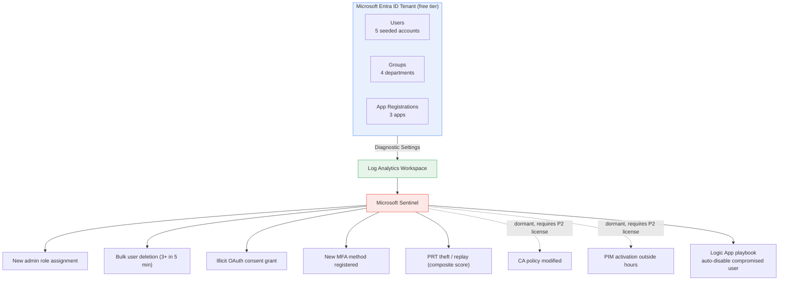
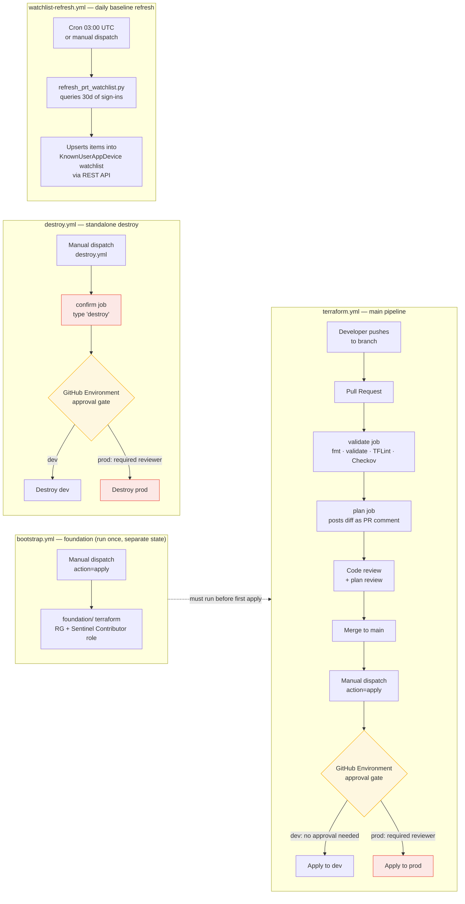

# Entra ID Cloud Threat Detection Lab — Terraform + Microsoft Sentinel

An automated cloud threat detection and response platform built on **Microsoft Sentinel**, provisioned entirely via **Terraform IaC** with a **GitHub Actions CI/CD pipeline**. Detects identity-based attacks in Microsoft Entra ID in real time and triggers automated incident response via a Logic App SOAR playbook.

> **Status: work in progress.**  Some detection rules are deployed but have not been validated end-to-end yet (see [Current Status & Limitations](#current-status--limitations)).


## What This Is

- **9 Sentinel analytics rules** covering the full identity attack chain — from initial access through persistence, privilege escalation, and credential theft
- **A composite-score PRT detection rule** backed by a rolling 30-day behavioural baseline watchlist, targeting a class of attack (Primary Refresh Token theft) that bypasses MFA and Conditional Access entirely
- **A SOAR playbook** (Logic App) that auto-disables compromised user accounts when Sentinel fires an incident
- **Dual alerting** — Sentinel incidents for SOC triage + email via Azure Monitor action groups
- **Full CI/CD** with Terraform, GitHub Actions, OIDC (no client secrets), Checkov security scanning, TFLint, drift detection, and approval-gated prod deploys
- **A separate watchlist refresh pipeline** that rebuilds the PRT baseline daily via the Sentinel REST API — out-of-band from Terraform state, by design

---

## Architecture Overview



### CI/CD Flow

Four separate workflow files, each with its own trigger and blast radius — deliberately not one mega-pipeline.



---

## Detection Rules

### Identity & Access

| Rule | MITRE | Severity | Source |
|------|-------|----------|--------|
| New Admin Role Assignment | T1078 — Privilege Escalation / Persistence | Medium | AuditLogs |
| Bulk User Deletion (3+ in 5 min) | T1531 — Account Access Removal | High | AuditLogs |
| Conditional Access Policy Modified | T1556 — Modify Authentication Process | Medium | AuditLogs |
| New MFA Method Registered | T1098 — Account Manipulation | Low | AuditLogs |
| PIM Role Activated Outside Business Hours | T1078 — Privilege Escalation | Medium | AuditLogs |

### Credential Theft & Token Abuse

| Rule | MITRE | Severity | Source |
|------|-------|----------|--------|
| Illicit Consent Grant — High-Privilege OAuth Scope | T1528 — Steal Application Access Token | High | AuditLogs |
| PRT Theft / Pass-the-PRT (Composite Score) | T1528, T1550 | High | SignInLogs + Watchlist |

### Sign-in Anomalies *(require SignInLogs — see Known Issues)*

| Rule | MITRE | Severity | Source |
|------|-------|----------|--------|
| Sign-in from Untrusted Location | T1078 — Initial Access | Medium | SignInLogs |
| Impossible Travel | T1078 — Initial Access | High | SignInLogs |

---

## Project Structure

```
.
├── foundation/                  # Runs once — creates RG + grants SP roles
│   ├── main.tf
│   ├── variables.tf
│   ├── outputs.tf
│   └── providers.tf
├── modules/
│   ├── monitoring/              # Core detection stack
│   │   ├── main.tf              # All Sentinel rules, watchlist, SOAR playbook
│   │   ├── variables.tf
│   │   └── outputs.tf
│   ├── users/                   # Entra ID user provisioning
│   ├── groups/                  # Department groups + break-glass
│   ├── app_registrations/       # OAuth app registrations
│   ├── conditional_access/      # CA policies (disabled — requires P2 license)
│   └── pim/                     # PIM assignments (disabled — requires P2 license)
├── scripts/
│   └── refresh_prt_watchlist.py # Watchlist baseline refresh script
├── .github/workflows/
│   ├── bootstrap.yml            # Manual — run once before first apply
│   ├── terraform.yml            # Main CI/CD pipeline
│   ├── destroy.yml              # Standalone destroy (two-layer protection)
│   └── watchlist-refresh.yml   # Daily PRT baseline refresh
├── main.tf                      # Root module — wires everything together
├── variables.tf
├── outputs.tf
├── providers.tf
└── bootstrap.sh                 # One-shot local bootstrap script
```

---

## Prerequisites

| Tool | Version | Purpose |
|------|---------|---------|
| Terraform CLI | >= 1.6.0 | IaC engine |
| Azure CLI | Latest | Authentication |
| Git | Any | Version control |
| jq | Any | Required by bootstrap script |
| Python 3 | Any | Required by `scripts/refresh_prt_watchlist.py` |
| VS Code + HCL extension | Any | IDE |

A free/standard Entra ID tenant (no P2 license) is sufficient for everything currently deployed. You do **not** need Entra ID P2, M365 E5, or the M365 Developer Program sandbox unless you want to re-enable and test the PIM/Conditional Access modules yourself.

---

## Initial Setup

### Option A — Bootstrap script (recommended)

A `bootstrap.sh` script is included in the repo root that automates all manual setup steps. Run it once before `terraform init`.

```bash
chmod +x bootstrap.sh
./bootstrap.sh
```

The script will prompt for:
- Tenant ID and Subscription ID
- Tenant domain (e.g. `contoso.onmicrosoft.com`)
- Company / project name
- GitHub org and repo name
- Azure region
- Alert email

It then handles everything in order:
1. Creates the Service Principal with Contributor role
2. Grants the required Microsoft Graph API permissions and admin consent
3. Assigns the Security Administrator role to the SP
4. Configures OIDC federated credentials (main, dev environment, PR)
5. Creates the remote state resource group, storage account, and container
6. Creates the Key Vault and grants your account Secrets Officer access
7. Grants the SP Key Vault Secrets User access
8. Prompts for the temporary user password and stores it in Key Vault
9. Generates `terraform.tfvars` automatically
10. Patches `providers.tf` with your storage account name
11. Prints all required GitHub secrets with their values

At the end, copy the printed secrets into **GitHub → Settings → Secrets → Actions**, then proceed to [Deploy](#deploy).

---

### Option B — Manual setup

If you prefer to run the steps yourself, follow the sections below.

#### 1. Create a Service Principal for Terraform

```bash
az login --tenant <your-tenant-id>

az ad sp create-for-rbac \
  --name "sp-terraform-iam" \
  --role "Contributor" \
  --scopes "/subscriptions/<subscription-id>"
```

Grant the SP these **Microsoft Graph API permissions** (App registrations → API permissions → Grant admin consent):

| Permission | Purpose |
|---|---|
| `Application.ReadWrite.All` | Create/manage app registrations and service principals |
| `Directory.ReadWrite.All` | Manage users, groups, and directory objects |
| `RoleManagement.ReadWrite.Directory` | Assign Entra ID roles (used for the Sentinel-related role assignments) |
| `User.ReadWrite.All` | Create, update, and delete user accounts |

> **Important:** All Graph API permissions require **admin consent** — granting the permission alone is not sufficient. Without consent, Terraform apply will fail with `Authorization_RequestDenied (403)`.

> **Note:** Use `Application.ReadWrite.All` and not `Application.ReadWrite.OwnedBy` — the narrower permission does not allow creating service principals or managing app passwords, which will cause 403 errors on `azuread_service_principal` and `azuread_application_password` resources.

> **Note:** `User.ReadWrite.All` is required for `terraform destroy` — without it the pipeline will fail with 403 when attempting to delete Entra ID users, even if apply succeeds.

Also assign the SP the **Security Administrator** Entra ID role to allow managing diagnostic settings:

1. Go to **Microsoft Entra ID** → **Roles and administrators**
2. Search for **Security Administrator** → **Add assignments** → select your SP

> This is required for the `azurerm_monitor_aad_diagnostic_setting` resource. Diagnostic settings for Entra ID live outside normal subscription scope and cannot be managed with Azure RBAC roles alone.

---

#### 2. Manual RBAC Administrator assignment

The SP needs **Role Based Access Control Administrator** at subscription scope to assign the Sentinel Responder role to the Logic App's managed identity. This must be done manually — a SP cannot bootstrap its own elevated permissions:

```bash
az role assignment create \
  --assignee-object-id <SP_OBJECT_ID> \
  --assignee-principal-type ServicePrincipal \
  --role "Role Based Access Control Administrator" \
  --scope /subscriptions/<SUBSCRIPTION_ID>
```

> **Why unconstrained?** An ABAC condition was attempted to constrain this to Sentinel Responder only. It worked at resource group scope but failed when the role assignment action targeted the Log Analytics workspace child resource — Azure's condition evaluation does not resolve `@Request[RoleDefinitionId]` correctly across scope inheritance boundaries at child resource level. Documented in [Known Issues](KNOWN_ISSUES.md).


#### 3. Configure OIDC Federated Identity (No Client Secrets)

This project uses **OIDC (Workload Identity Federation)** — GitHub exchanges a short-lived JWT with Azure on every run. No client secrets are stored anywhere.

```bash
az ad app federated-credential create --id <APP_CLIENT_ID> --parameters '{
  "name": "github-main",
  "issuer": "https://token.actions.githubusercontent.com",
  "subject": "repo:<org>/<repo>:ref:refs/heads/main",
  "audiences": ["api://AzureADTokenExchange"]
}'

az ad app federated-credential create --id <APP_CLIENT_ID> --parameters '{
  "name": "github-env-dev",
  "issuer": "https://token.actions.githubusercontent.com",
  "subject": "repo:<org>/<repo>:environment:dev",
  "audiences": ["api://AzureADTokenExchange"]
}'

az ad app federated-credential create --id <APP_CLIENT_ID> --parameters '{
  "name": "github-pr",
  "issuer": "https://token.actions.githubusercontent.com",
  "subject": "repo:<org>/<repo>:pull_request",
  "audiences": ["api://AzureADTokenExchange"]
}'
```

---

#### 4. Create Remote State Storage

```bash
az group create --name rg-terraform-state --location <region>

az storage account create \
  --name tfstateiam \
  --resource-group rg-terraform-state \
  --location <region> \
  --sku Standard_LRS \
  --encryption-services blob

az storage container create \
  --name tfstate \
  --account-name tfstateiam
```

---

#### 5. Create Key Vault and Store Temp Password

```bash
az keyvault create \
  --name kv-iam-<yourname> \
  --resource-group rg-terraform-state \
  --location eastus \
  --sku standard

# Grant yourself Secrets Officer access
az role assignment create \
  --role "Key Vault Secrets Officer" \
  --assignee <your-object-id> \
  --scope "/subscriptions/<subscription-id>/resourcegroups/rg-terraform-state/providers/Microsoft.KeyVault/vaults/kv-iam-<yourname>"
```

Wait 30 seconds for the role to propagate, then store the password:

```bash
az keyvault secret set \
  --vault-name kv-iam-<yourname> \
  --name "user-temp-password" \
  --value "<your-temp-password>" \
  --query "{name:name, id:id}" \
  -o table
```

Grant the SP read access to the vault:

```bash
az role assignment create \
  --role "Key Vault Secrets User" \
  --assignee <APP_CLIENT_ID> \
  --scope "/subscriptions/<SUBSCRIPTION_ID>/resourceGroups/rg-terraform-state/providers/Microsoft.KeyVault/vaults/kv-iam-<yourname>"
```

---

#### 6. Configure Variables

```bash
cp terraform.tfvars.example terraform.tfvars
# Edit terraform.tfvars with your tenant values
```

> Make sure `alert_email` is a real email address you own — Azure will reject placeholder addresses when creating the action group.

---

## Deploy

### Step 1 — Add GitHub repository variables

**Settings → Variables → Actions:**

| Variable | Value |
|----------|-------|
| `COMPANY_NAME` | Your company name (used in resource naming) |
| `AZURE_LOCATION` | e.g. `southafricanorth` |

### Step 2 — Add GitHub repository secrets

**Settings → Secrets → Actions:**

| Secret | Description |
|--------|-------------|
| `AZURE_CLIENT_ID_DEV` | SP client ID |
| `AZURE_SUBSCRIPTION_ID_DEV` | Subscription ID |
| `AZURE_TENANT_ID_DEV` | Tenant ID |
| `AZURE_TENANT_DOMAIN_DEV` | e.g. `contoso.onmicrosoft.com` |
| `TF_STATE_ACCESS_KEY_DEV` | Storage account access key |
| `KEY_VAULT_NAME_DEV` | Key Vault name |
| `ALERT_EMAIL` | Email for security alert notifications |

> `AZURE_CLIENT_SECRET` is intentionally absent — OIDC eliminates the need for it.

### Step 3 — Create GitHub Environments

**Settings → Environments → New environment:**
- `dev` — no protection rules needed
- `prod` — add Required reviewers

### Step 4 — Run bootstrap pipeline

```
Actions → Bootstrap Foundation → Run workflow → dev → apply
```

### Step 5 — Deploy

```
Actions → Terraform IAM Pipeline → Run workflow → dev → apply
```

On first deploy, `azurerm_monitor_aad_diagnostic_setting` may fail with a provider inconsistency error — re-run apply. See [Known Issues](KNOWN_ISSUES.md).

### Step 6 — Grant playbook Graph permissions

```bash
bash scripts/grant_playbook_permissions.sh
```

### Step 7 — Seed the PRT watchlist

```
Actions → PRT Watchlist Refresh → Run workflow → dev
```

---

## Deployment Notes

### Propagation waits

Two `time_sleep` resources work around Azure's asynchronous RBAC propagation:

- `wait_for_sentinel_permissions` — 300 seconds after Sentinel onboarding, before any rules are created
- `wait_for_logic_app_identity` — 120 seconds after Logic App creation, before the Sentinel Responder role is assigned to its managed identity

### Two-environment support

The pipeline supports `dev` and `prod` via workflow dispatch inputs. Prod requires a designated reviewer to approve before apply or destroy. Nightly drift detection is disabled until prod is configured — see `terraform.yml`.

### Destroying and recreating

`terraform destroy` wipes main state but leaves foundation intact (separate state file). Order for full teardown: main destroy → bootstrap destroy. See [Known Issues](KNOWN_ISSUES.md) for what roles need recreating after destroy.

---


## CI/CD Pipeline

The project uses four workflow files under `.github/workflows/`, each scoped to a different job:

### `bootstrap.yml` — foundation pipeline

Runs the `foundation/` root module, which has its own state file (`foundation.terraform.tfstate`), separate from the main pipeline's state. It creates the IAM resource group and grants the Terraform SP the **Microsoft Sentinel Contributor** role on that resource group — a prerequisite the main pipeline needs before it can create Sentinel analytics rules.

Manual dispatch only — never runs automatically. Needs to be run:
- The first time you set up a new environment
- Any time `terraform destroy` wipes the IAM resource group and you need to recreate it

This pipeline itself depends on the Terraform SP already holding a condition-constrained **Role Based Access Control Administrator** assignment on the subscription, granted once by a human with Owner/User Access Administrator rights (`bootstrap.sh` does this automatically). The condition restricts the SP to assigning only two specific roles, so it can never self-escalate to Owner. Without that pre-existing assignment, this pipeline fails with a 403 on `Microsoft.Authorization/roleAssignments/write`.

**Run order:** `bootstrap.yml` first, then `terraform.yml` with `action=apply`.

### `terraform.yml` — main pipeline

| Job | Trigger | What it does |
|-----|---------|-------------|
| `validate` | Every push/PR | `fmt` check, `validate`, TFLint, Checkov security scan |
| `plan` | Every push/PR + manual dispatch | Plans against target environment, posts diff as PR comment |
| `apply` | Manual dispatch (`action=apply`) | Applies the saved plan after environment approval gate |

A nightly scheduled run (02:00 UTC) runs `plan` against prod in read-only mode to detect drift — any difference between live infrastructure and Terraform state is flagged as a warning in the Actions log.

### `destroy.yml` — standalone destroy pipeline

Kept intentionally separate from the main pipeline to reduce the risk of accidental invocation. Only triggered manually via `workflow_dispatch`.

**Two-layer protection before anything is deleted:**
1. A `confirm` job that fails immediately if the input field doesn't contain the word `destroy` exactly
2. The GitHub Environment approval gate, which requires a designated reviewer to approve before the destroy job runs

To invoke: **Actions → Terraform Destroy → Run workflow → select environment → type `destroy` → Run workflow**

> The destroy workflow shares the same concurrency group as the main pipeline (`terraform-<environment>`), so a running apply will block a destroy and vice versa.

### `watchlist-refresh.yml` — PRT baseline refresh

Runs daily (03:00 UTC) and on manual dispatch. Queries the last 30 days of sign-in logs for `UserPrincipalName + AppId + DeviceId` combinations and upserts them into the `KnownUserAppDevice` Sentinel watchlist via `scripts/refresh_prt_watchlist.py`. Kept outside the main Terraform pipeline because it manages watchlist *items*, not Terraform-managed resource state.

### Required GitHub Secrets

| Secret | Description |
|--------|-------------|
| `AZURE_CLIENT_ID_DEV` | App registration client ID (DEV) |
| `AZURE_SUBSCRIPTION_ID_DEV` | Subscription ID (DEV) |
| `AZURE_TENANT_ID_DEV` | Tenant ID (DEV) |
| `AZURE_TENANT_DOMAIN_DEV` | e.g. `contoso.onmicrosoft.com` (DEV) |
| `TF_STATE_ACCESS_KEY_DEV` | Storage account access key for state (DEV) |
| `ALERT_EMAIL` | Email address for Azure Monitor action group alerts |

> `AZURE_CLIENT_SECRET` is intentionally absent — OIDC eliminates the need for it.

> If you used `bootstrap.sh`, all secret values are printed at the end of the script — no need to look them up manually.

### Setting Up GitHub Environments

Go to **GitHub repo → Settings → Environments → New environment:**

- Create `dev` — no protection rules needed
- Create `prod` — add **Required reviewers** (add yourself) so prod requires manual approval before applying or destroying

---

## Security Design Decisions

| Decision | Rationale |
|----------|-----------|
| OIDC instead of client secrets | Short-lived tokens — no long-lived credentials stored in GitHub |
| Remote state in Azure Storage | State is encrypted at rest, not stored in Git |
| `terraform.tfvars` in `.gitignore` | Prevents credentials leaking to Git |
| Key Vault Secrets User (not Owner) on SP | Least-privilege — read-only access to secrets |
| Passwords stored in Key Vault | Never hardcoded — fetched at apply time, marked sensitive |
| Destroy in a separate workflow file | Reduces accidental invocation risk; requires typed confirmation + approval gate |
| PRT watchlist refresh kept outside Terraform | Terraform can't safely own append-only watchlist item content — see comment in `modules/monitoring/main.tf` |

---


## Known Issues & Workarounds

### AuthorizationFailed on azurerm_role_assignment (bootstrap.yml)
The `bootstrap.yml` foundation pipeline fails with a 403 `AuthorizationFailed` on `Microsoft.Authorization/roleAssignments/write` if the Terraform SP doesn't already hold a **Role Based Access Control Administrator** assignment on the subscription.

**Fix:** A human with Owner or User Access Administrator rights needs to grant the SP a RBAC Administrator role once, up front.

### PRT replay rule needs the watchlist populated first
The `prt_replay_detection` rule explicitly suppresses all findings until the `KnownUserAppDevice` watchlist has at least one item (to avoid every sign-in scoring a false +2 on a cold-start empty baseline). Run `.github/workflows/watchlist-refresh.yml` manually at least once after deploying the monitoring module, before expecting this rule to produce anything.

### Key Vault Forbidden on secret set
If you get a 403 when setting Key Vault secrets via CLI, your account lacks an access policy or RBAC role on the vault.

**Fix:**
```bash
az role assignment create \
  --role "Key Vault Secrets Officer" \
  --assignee <your-object-id> \
  --scope "/subscriptions/<sub-id>/resourcegroups/<rg>/providers/Microsoft.KeyVault/vaults/<vault-name>"
```

### 403 on destroy — user deletion fails
If `terraform destroy` fails with `Authorization_RequestDenied` when deleting Entra ID users, the SP is missing `User.ReadWrite.All`.

**Fix:** Entra ID → App registrations → your SP → API permissions → Add `User.ReadWrite.All` (Application) → Grant admin consent → re-run destroy.

---


## Skills Demonstrated

- Terraform modular IaC with remote state, targeting Microsoft Entra ID + Azure Monitor/Sentinel
- KQL query writing for identity threat detection, including a multi-signal composite-scoring rule (PRT replay)
- Microsoft Sentinel SIEM integration: workspace onboarding, scheduled analytics rules, entity mapping, MITRE ATT&CK tagging, watchlists
- GitHub Actions CI/CD with OIDC Workload Identity Federation, environment approval gates, and a scheduled data-refresh job outside the main IaC pipeline
- Security scanning in CI (Checkov, TFLint)
- Python scripting(watchlist refresh script & illicit consent grant script)


