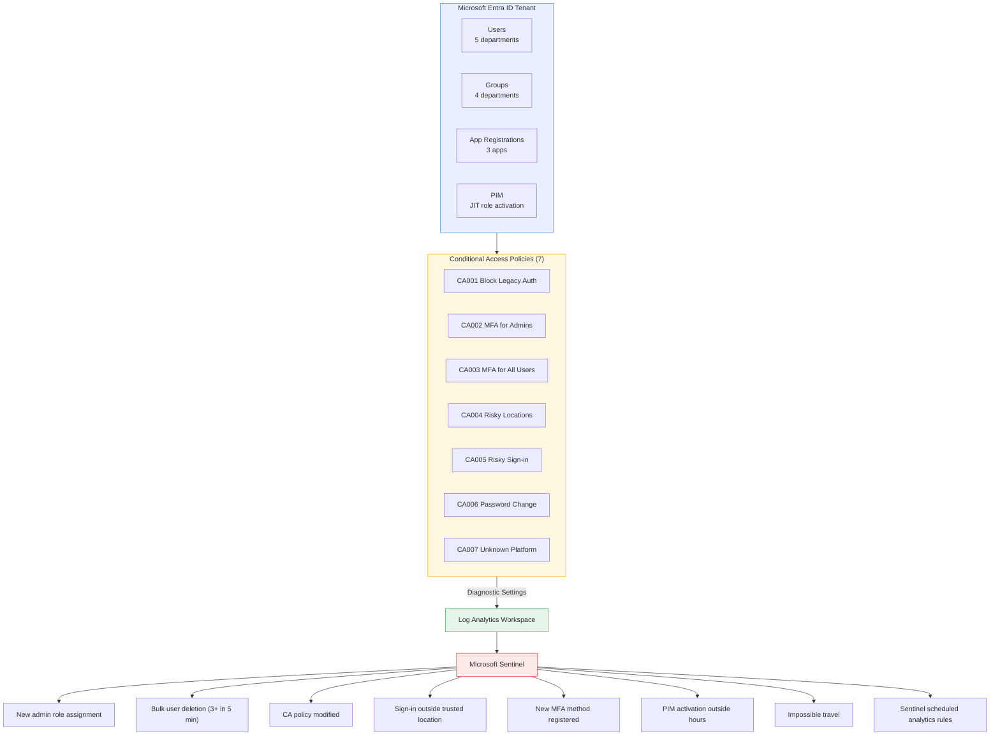
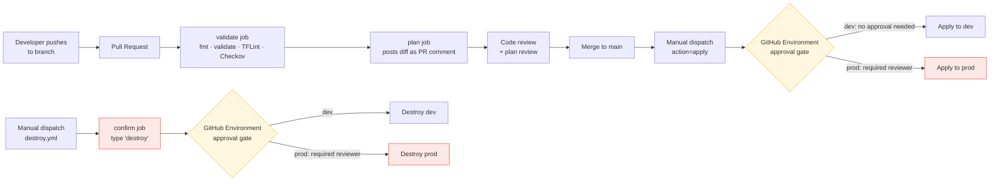

# Enterprise IAM Project — Microsoft Entra ID + Terraform

An Identity and Access Management solution built on **Microsoft Entra ID**, fully provisioned via **Terraform IaC** with a **GitHub Actions CI/CD pipeline**.

## Architecture Overview



### CI/CD Flow



---

## Prerequisites

| Tool | Version | Purpose |
|------|---------|---------|
| Terraform CLI | >= 1.6.0 | IaC engine |
| Azure CLI | Latest | Authentication |
| Git | Any | Version control |
| jq | Any | Required by bootstrap script |
| VS Code + HCL extension | Any | IDE |

---

## Initial Setup

### Option A — Bootstrap script (recommended)

A `bootstrap.sh` script is included in the repo root that automates all manual setup steps. Run it once before `terraform init`.

```bash
chmod +x bootstrap.sh
./bootstrap.sh
```

The script will prompt for:
- Tenant ID and Subscription ID
- Tenant domain (e.g. `contoso.onmicrosoft.com`)
- Company / project name
- GitHub org and repo name
- Azure region
- Alert email

It then handles everything in order:
1. Creates the Service Principal with Contributor role
2. Grants all required Microsoft Graph API permissions and admin consent
3. Assigns the Security Administrator role to the SP
4. Configures OIDC federated credentials (main, dev environment, PR)
5. Creates the remote state resource group, storage account, and container
6. Creates the Key Vault and grants your account Secrets Officer access
7. Grants the SP Key Vault Secrets User access
8. Prompts for the temporary user password and stores it in Key Vault
9. Generates `terraform.tfvars` automatically
10. Patches `providers.tf` with your storage account name
11. Prints all required GitHub secrets with their values

At the end, copy the printed secrets into **GitHub → Settings → Secrets → Actions**, then proceed to [Deploy](#deploy).

---

### Option B — Manual setup

If you prefer to run the steps yourself, follow the sections below.

#### 1. Get a Tenant with the Required Licenses

This project requires **Entra ID P2** for the full feature set (Conditional Access + PIM). The following options all work:

| Option | CA | PIM | Notes |
|---|---|---|---|
| M365 Developer Program | ✅ | ✅ | Free 90-day renewable sandbox — recommended for testing. Sign up at [developer.microsoft.com/microsoft-365/dev-program](https://developer.microsoft.com/microsoft-365/dev-program) |
| Microsoft Entra ID P2 (standalone) | ✅ | ✅ | Covers both features directly |
| Microsoft 365 E5 | ✅ | ✅ | Includes Entra ID P2 out of the box |
| Microsoft 365 E3 + Entra ID P2 add-on | ✅ | ✅ | E3 alone does not include P2 |
| Microsoft 365 Business Premium | ✅ | ❌ | Includes Entra ID P1 — CA works but PIM is not available |

> **Note:** M365 Business Premium is not sufficient for this project — PIM requires Entra ID P2.

---

#### 2. Create a Service Principal for Terraform

```bash
az login --tenant <your-tenant-id>

az ad sp create-for-rbac \
  --name "sp-terraform-iam" \
  --role "Contributor" \
  --scopes "/subscriptions/<subscription-id>"
```

Grant the SP these **Microsoft Graph API permissions** (App registrations → API permissions → Grant admin consent):

| Permission | Purpose |
|---|---|
| `Application.ReadWrite.All` | Create/manage app registrations and service principals |
| `Directory.ReadWrite.All` | Manage users, groups, and directory objects |
| `Policy.ReadWrite.ConditionalAccess` | Create and update CA policies |
| `RoleManagement.ReadWrite.Directory` | Assign Entra ID roles |
| `PrivilegedAccess.ReadWrite.AzureAD` | Configure PIM policies and assignments |
| `RoleEligibilitySchedule.ReadWrite.Directory` | Read, update, and delete eligible role assignments |
| `User.ReadWrite.All` | Create, update, and delete user accounts |

> **Important:** All Graph API permissions require **admin consent** — granting the permission alone is not sufficient. Without consent, Terraform apply will fail with `Authorization_RequestDenied (403)`.

> **Note:** Use `Application.ReadWrite.All` and not `Application.ReadWrite.OwnedBy` — the narrower permission does not allow creating service principals or managing app passwords, which will cause 403 errors on `azuread_service_principal` and `azuread_application_password` resources.

> **Note:** `User.ReadWrite.All` is required for `terraform destroy` — without it the pipeline will fail with 403 when attempting to delete Entra ID users, even if apply succeeds.

Also assign the SP the **Security Administrator** Entra ID role to allow managing diagnostic settings:

1. Go to **Microsoft Entra ID** → **Roles and administrators**
2. Search for **Security Administrator** → **Add assignments** → select your SP

> This is required for the `azurerm_monitor_aad_diagnostic_setting` resource. Diagnostic settings for Entra ID live outside normal subscription scope and cannot be managed with Azure RBAC roles alone.

---

#### 3. Configure OIDC Federated Identity (No Client Secrets)

This project uses **OIDC (Workload Identity Federation)** — GitHub exchanges a short-lived JWT with Azure on every run. No client secrets are stored anywhere.

```bash
az ad app federated-credential create --id <APP_CLIENT_ID> --parameters '{
  "name": "github-main",
  "issuer": "https://token.actions.githubusercontent.com",
  "subject": "repo:<org>/<repo>:ref:refs/heads/main",
  "audiences": ["api://AzureADTokenExchange"]
}'

az ad app federated-credential create --id <APP_CLIENT_ID> --parameters '{
  "name": "github-env-dev",
  "issuer": "https://token.actions.githubusercontent.com",
  "subject": "repo:<org>/<repo>:environment:dev",
  "audiences": ["api://AzureADTokenExchange"]
}'

az ad app federated-credential create --id <APP_CLIENT_ID> --parameters '{
  "name": "github-pr",
  "issuer": "https://token.actions.githubusercontent.com",
  "subject": "repo:<org>/<repo>:pull_request",
  "audiences": ["api://AzureADTokenExchange"]
}'
```

Each credential maps to a different pipeline trigger:

| Credential | Subject | Covers |
|---|---|---|
| `github-main` | `repo:<org>/<repo>:ref:refs/heads/main` | Push to main |
| `github-env-dev` | `repo:<org>/<repo>:environment:dev` | `workflow_dispatch` targeting dev |
| `github-pr` | `repo:<org>/<repo>:pull_request` | Pull requests |

> Use the exact GitHub repo name (case-sensitive). If OIDC auth fails, check the `Azure Login` step logs — it shows the exact subject string GitHub is sending.

---

#### 4. Create Terraform Remote State Storage

```bash
az group create --name rg-terraform-state --location eastus

az storage account create \
  --name tfstateiam \
  --resource-group rg-terraform-state \
  --sku Standard_LRS \
  --encryption-services blob

az storage container create \
  --name tfstate \
  --account-name tfstateiam
```

---

#### 5. Create Key Vault and Store Temp Password

```bash
az keyvault create \
  --name kv-iam-<yourname> \
  --resource-group rg-terraform-state \
  --location eastus \
  --sku standard

# Grant yourself Secrets Officer access
az role assignment create \
  --role "Key Vault Secrets Officer" \
  --assignee <your-object-id> \
  --scope "/subscriptions/<subscription-id>/resourcegroups/rg-terraform-state/providers/Microsoft.KeyVault/vaults/kv-iam-<yourname>"
```

Wait 30 seconds for the role to propagate, then store the password:

```bash
az keyvault secret set \
  --vault-name kv-iam-<yourname> \
  --name "user-temp-password" \
  --value "<your-temp-password>" \
  --query "{name:name, id:id}" \
  -o table
```

Grant the SP read access to the vault:

```bash
az role assignment create \
  --role "Key Vault Secrets User" \
  --assignee <APP_CLIENT_ID> \
  --scope "/subscriptions/<SUBSCRIPTION_ID>/resourceGroups/rg-terraform-state/providers/Microsoft.KeyVault/vaults/kv-iam-<yourname>"
```

---

#### 6. Configure Variables

```bash
cp terraform.tfvars.example terraform.tfvars
# Edit terraform.tfvars with your tenant values
```

> Make sure `alert_email` is a real email address you own — Azure will reject placeholder addresses when creating the action group.

---

## Deploy

```bash
terraform init
terraform validate
terraform plan
terraform apply
```

---

## Known Issues & Workarounds

### SignInLogs table not found
Alert rules that query `SignInLogs` will fail on first deploy because the table doesn't exist until sign-in data starts flowing into Log Analytics.

**Fix:**
1. Comment out `signin_outside_trusted` and `impossible_travel` in `modules/monitoring/main.tf`
2. Run `terraform apply` — everything else deploys including diagnostic settings
3. Sign out and back into the Portal with your admin account
4. Wait 10-15 minutes for the first sign-in logs to stream through
5. Verify the table exists: **Log Analytics → Logs → run `SignInLogs | take 5`**
6. Uncomment the two rules and re-run `terraform apply`

### PIM 403 PermissionScopeNotGranted
Terraform cannot create PIM eligible assignments without the **Privileged Role Administrator** role on your account.

**Fix:** Entra ID → Roles and administrators → Privileged Role Administrator → Add assignments → your account → wait 30 seconds → re-run `terraform apply`

### Key Vault Forbidden on secret set
If you get a 403 when setting Key Vault secrets via CLI, your account lacks an access policy or RBAC role on the vault.

**Fix:**
```bash
az role assignment create \
  --role "Key Vault Secrets Officer" \
  --assignee <your-object-id> \
  --scope "/subscriptions/<sub-id>/resourcegroups/<rg>/providers/Microsoft.KeyVault/vaults/<vault-name>"
```

### 403 on destroy — user deletion fails
If `terraform destroy` fails with `Authorization_RequestDenied` when deleting Entra ID users, the SP is missing `User.ReadWrite.All`.

**Fix:** Entra ID → App registrations → your SP → API permissions → Add `User.ReadWrite.All` (Application) → Grant admin consent → re-run destroy.

---

## CI/CD Pipeline

The project uses two workflow files under `.github/workflows/`:

### `terraform.yml` — main pipeline

| Job | Trigger | What it does |
|-----|---------|-------------|
| `validate` | Every push/PR | `fmt` check, `validate`, TFLint, Checkov security scan |
| `plan` | Every push/PR + manual dispatch | Plans against target environment, posts diff as PR comment |
| `apply` | Manual dispatch (`action=apply`) | Applies the saved plan after environment approval gate |

A nightly scheduled run (02:00 UTC) runs `plan` against prod in read-only mode to detect drift — any difference between live infrastructure and Terraform state is flagged as a warning in the Actions log.

### `destroy.yml` — standalone destroy pipeline

Kept intentionally separate from the main pipeline to reduce the risk of accidental invocation. Only triggered manually via `workflow_dispatch`.

**Two-layer protection before anything is deleted:**
1. A `confirm` job that fails immediately if the input field doesn't contain the word `destroy` exactly
2. The GitHub Environment approval gate, which requires a designated reviewer to approve before the destroy job runs

To invoke: **Actions → Terraform Destroy → Run workflow → select environment → type `destroy` → Run workflow**

> The destroy workflow shares the same concurrency group as the main pipeline (`terraform-<environment>`), so a running apply will block a destroy and vice versa.

### Required GitHub Secrets

| Secret | Description |
|--------|-------------|
| `AZURE_CLIENT_ID_DEV` | App registration client ID (DEV) |
| `AZURE_SUBSCRIPTION_ID_DEV` | Subscription ID (DEV) |
| `AZURE_TENANT_ID_DEV` | Tenant ID (DEV) |
| `AZURE_TENANT_DOMAIN_DEV` | e.g. `contoso.onmicrosoft.com` (DEV) |
| `TF_STATE_ACCESS_KEY_DEV` | Storage account access key for state (DEV) |
| `ALERT_EMAIL` | Email address for Azure Monitor action group alerts |

> `AZURE_CLIENT_SECRET` is intentionally absent — OIDC eliminates the need for it.

> If you used `bootstrap.sh`, all secret values are printed at the end of the script — no need to look them up manually.

### Setting Up GitHub Environments

Go to **GitHub repo → Settings → Environments → New environment:**

- Create `dev` — no protection rules needed
- Create `prod` — add **Required reviewers** (add yourself) so prod requires manual approval before applying or destroying

---

## Security Design Decisions

| Decision | Rationale |
|----------|-----------|
| OIDC instead of client secrets | Short-lived tokens — no long-lived credentials stored in GitHub |
| CA policies start in report-only mode in `dev` | Prevents accidental lockout during testing |
| Break-glass group excluded from all CA policies | Ensures emergency access is always available |
| PIM requires MFA + justification on activation | Eliminates standing privileged access |
| App implicit grant disabled | Forces auth code + PKCE — more secure |
| `app_role_assignment_required = true` on SPs | Users cannot self-assign to apps |
| Remote state in Azure Storage | State is encrypted at rest, not stored in Git |
| `terraform.tfvars` in `.gitignore` | Prevents credentials leaking to Git |
| Key Vault Secrets User (not Owner) on SP | Least-privilege — read-only access to secrets |
| Passwords stored in Key Vault | Never hardcoded — fetched at apply time, marked sensitive |
| Destroy in a separate workflow file | Reduces accidental invocation risk; requires typed confirmation + approval gate |

---

## Monitoring — Alert Summary

| Alert | Severity | Detection Window | Source |
|-------|----------|-----------------|--------|
| New admin role assignment | Medium | Immediate | Log Analytics |
| Bulk user deletion (3+) | High | 5 min | Log Analytics |
| CA policy modified/deleted | Medium | Immediate | Log Analytics |
| Sign-in from risky location | Low | 15 min | Log Analytics |
| New MFA method registered | Low | Immediate | Log Analytics |
| PIM activation outside hours | Medium | Immediate | Log Analytics |
| Impossible travel | High | 1 hr | Sentinel scheduled analytics rule |

Sentinel scheduled analytics rules are provisioned via the monitoring module (`azurerm_sentinel_alert_rule_scheduled`) and run KQL queries on a defined cadence against the Log Analytics workspace. See `modules/monitoring/main.tf` for rule definitions.

---

## Skills Demonstrated

- Microsoft Entra ID (users, groups, apps, CA, PIM)
- Terraform modular IaC with remote state
- Zero-trust security design
- Just-in-time privileged access (PIM)
- KQL query writing for threat detection
- Microsoft Sentinel SIEM integration with scheduled analytics rules
- GitHub Actions CI/CD with OIDC Workload Identity Federation
- Security scanning (Checkov, TFLint)